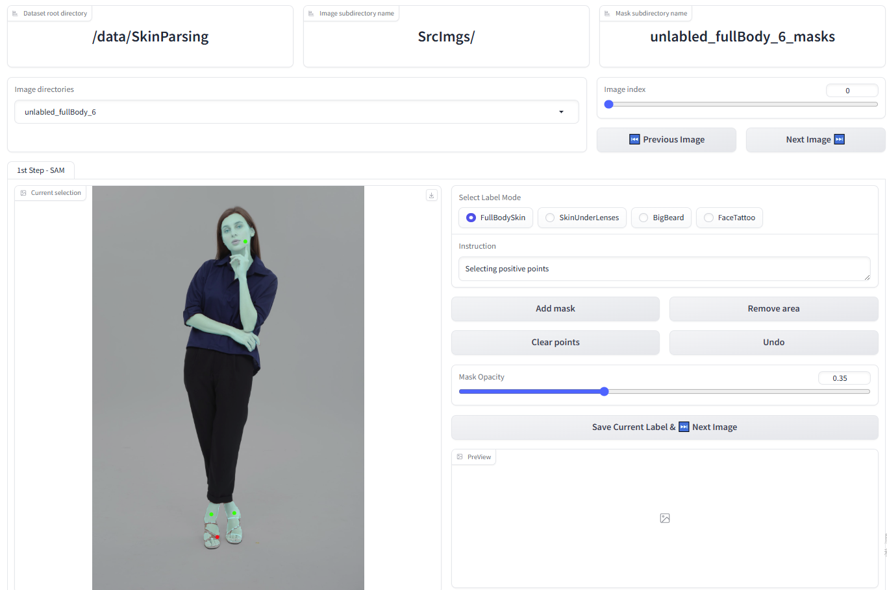

<!-- PROJECT LOGO -->
<br />
<div align="center">
  <h3 align="center">SAM2 UI Testbed</h3>

</div>


<!-- TABLE OF CONTENTS -->
<details>
  <summary>Table of Contents</summary>
  <ol>
    <li><a href="#about-the-project">About The Project</a></li>
    <li><a href="#built-with">Built With</a></li>
    <li><a href="#getting-started">Getting Started</a>
      <ul>
        <li><a href="#prerequisites">Prerequisites</a></li>
        <li><a href="#installation">Installation</a></li>
      </ul>
    </li>
    <li><a href="#usage">Usage</a></li>
    <li><a href="#acknowledgments">Acknowledgments</a></li>
  </ol>
</details>


<!-- ABOUT THE PROJECT -->
## About The Project

This project provides a simple Gradio-based interface for testing SAM2, 
Meta AI's state-of-the-art image segmentation model.

<p align="right">(<a href="#readme-top">back to top</a>)</p>


### Built With

This section should list any major frameworks/libraries used to bootstrap your project. Leave any add-ons/plugins for the acknowledgements section. Here are a few examples.

* [![Gradio][Gradio.com]][Gradio-url]
* [SAM2](https://github.com/facebookresearch/sam2)

<p align="right">(<a href="#readme-top">back to top</a>)</p>


<!-- GETTING STARTED -->
## Getting Started

Follow these steps to get the project up and running locally.

### Prerequisites

Ensure you have Python 3.8+ and pip installed. Then, install the required libraries:
* bash
  ```sh
  pip install gradio==4.40.0
  pip install loguru
  ```

### Installation

You must also install SAM2 by following its official installation instructions:

👉 [SAM2 GitHub Installation Guide](https://github.com/facebookresearch/sam2#installation)

> **Note**: SAM2 may require `torch`, `torchvision`, and other dependencies. Refer to their documentation for details.


Clone this repository:
* bash
  ```sh
  git clone https://github.com/your-username/sam2-ui-testbed.git sam2_git && cd sam2_git
  
  pip install -e .
  ```

<p align="right">(<a href="#readme-top">back to top</a>)</p>


<!-- USAGE EXAMPLES -->
## Usage

Once everything is installed, run the app using:

* bash
  ```sh
  python app.py --port 7890 --data_dir /data/SkinParsing --src_img_dir_name "SrcImgs/" --ui_mode ui_seg 
  ```

This will launch a Gradio web interface in your browser where you can upload images and interact with SAM2 for segmentation tasks.

### Command Line Arguments

- `--port`: (int) The port number for running the Gradio app (default: `7890`).

- `--data_dir`: (str) Path to the root data directory that contains input images.

- `--src_img_dir_name`: (str) Subdirectory name inside `data_dir` that contains source images.

- `--ui_mode`: (str) Mode of the UI interface. Example: `ui_seg` for segmentation interface.

> 💡 You can modify these values based on your local directory structure or custom setup.

<p align="right">(<a href="#readme-top">back to top</a>)</p>

### After Launching the App

Once the app is launched, the following screen appears:



<!-- LICENSE -->
## License

Distributed under the Unlicense License. See `LICENSE.txt` for more information.

<p align="right">(<a href="#readme-top">back to top</a>)</p>


<!-- ACKNOWLEDGMENTS -->
## Acknowledgments

Use this space to list resources you find helpful and would like to give credit to. I've included a few of my favorites to kick things off!

* [Gradio](https://www.gradio.app/)
* [AM2 by Meta AI](https://github.com/facebookresearch/sam2)

<p align="right">(<a href="#readme-top">back to top</a>)</p>


<!-- MARKDOWN LINKS & IMAGES -->
<!-- https://www.markdownguide.org/basic-syntax/#reference-style-links -->


[Gradio.com]: https://avatars.githubusercontent.com/u/51063788?s=48&v=4
[Gradio-url]: https://www.gradio.app/
